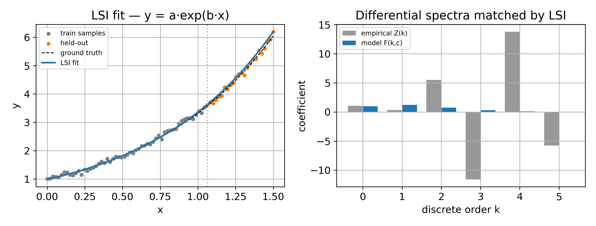

# LSI -- Least-Squares Integral

!!! note
    Adapted from the project [wiki](https://github.com/ringavirda/science-nonline/wiki/Methods-LSI). The wiki has the full set of method, domain and case-study pages.
> Numeric batch method, successor to the symbolic DSBI. Source:
> [`image/fit.py`](https://github.com/ringavirda/science-nonline/blob/main/packages/dtfit/src/dtfit/image/fit.py); the basis
> machinery is in
> [`image/bases.py`](https://github.com/ringavirda/science-nonline/blob/main/packages/dtfit/src/dtfit/image/bases.py).
> Invoke via `fit_lsi(x, y, expr, var, ...)`, `fit(model, data,
> basis="legendre")`, or `NonlineRegressor(..., method="lsi")`.

LSI is [`fit`](image.md#the-projected-estimator) in the Legendre image:
the projected least-squares estimator restricted to the span of the Legendre
polynomials on the sample grid, the numeric successor of the symbolic
[DSBI](https://github.com/ringavirda/science-nonline/wiki/Methods-DSB). It fits the raw `(x, y)` directly (no symbolic pre-fit)
and is the accurate batch/offline fitter and the natural model-selection
tool.

## Mathematical grounding

LSI minimizes the $L^2$ criterion restricted to the span of the Legendre
basis on the sample grid, not a continuous reconstruction error: with the
image `S = Phi^T (w y)`, `G = Phi^T diag(w) Phi` of [the image](image.md)
built at order `K`, and `S_f(theta)` the model projected the same way, the
criterion is

$$
J(\theta) = \big(S - S_f(\theta)\big)^\top G^+ \big(S - S_f(\theta)\big)
          = \big\| L^{-1}(S - S_f(\theta)) \big\|^2, \qquad G = L L^\top .
$$

In the monomial basis `G` is a Hilbert-like Gram matrix, ill-conditioned by
construction and only getting worse with order. In the Legendre basis on a
uniform grid `G` is near-diagonal -- Legendre polynomials are orthogonal on
`[-1, 1]` under the continuous inner product, and a dense uniform sample sum
approaches that integral -- so the Cholesky whitening `L^-1` is well
conditioned instead of amplifying noise the way a monomial fit would.

## Algorithm

1. **Parse** the model `expr`; collect the free parameters `theta`.
2. **Order**: `order_for(model, p0, domain)` by default, the smallest
   Legendre order at which every parameter sensitivity is represented to 2 %
   relative L2 error, floored at `n_params - 1`; an explicit `k_star` (or
   `order`) overrides it and must leave at least as many coefficients as
   parameters.
3. **Image**: build `S` and `G` at that order from the samples.
4. **Project** the model and its sensitivities on the same grid, with the
   same weights, to get `S_f(theta)` and its Jacobian.
5. **Whiten** the residual `S - S_f(theta)` by the Cholesky factor of `G`.
6. **Solve**: Levenberg-Marquardt from the supplied/unit start when there are
   no bounds; trust-region when bounds are given, followed by a
   differential-evolution stage only when every bound is finite and the
   local solve fails, returns a non-finite cost, or explains less than half
   the weighted total sum of squares -- a `UserWarning` announces the
   fallback.
7. **Covariance** from the SVD of the whitened residual's Jacobian, scaled
   by `RSS / (n - p)` unless `absolute_sigma=True`; a parameter in a null
   direction of the Jacobian is unidentified and gets `inf` on its diagonal,
   `nan` off it.
8. **Coverage**: `coverage(model, p0, image)` measures the truncation error
   left at the chosen order; `fit`/`fit_lsi` raise a `UserWarning` above 2 %,
   meaning the image is too coarse to identify the model.

## The oscillatory recipe

A low default order erases a cycle -- there is no smoothing step to disable,
since none runs at any order. For oscillatory models LSI applies a
validated recipe, switched on by `oscillatory=True` or by naming the
angular-frequency parameter with `freq_param=`:

- **order raised** to `osc_order(x, y)`, `ceil(pi * cycles) + 8` where
  `cycles` is the number of periods of the FFT-peak frequency spanned by
  `x` -- the polynomial resolution threshold for a sinusoid, with headroom,
  taken over `order_for`'s own default when it is larger;
- **frequency seeded** from the data's FFT peak via
  [`fft_frequency_seed`](../api/batch-fitting.md#fft_frequency_seed) before the solve,
  overwriting `p0` for that parameter -- the local solve cannot lock onto
  the right cycle without it.

The bounded case follows the same solver rule as any other fit: an
unbounded fit runs Levenberg-Marquardt from the seeded start; a bounded fit
runs the trust-region solve first and only falls to differential evolution
under the condition above, so a tight frequency bound pins the cycle as
well as the seed does.

With the recipe a sinusoid recovers to under 1 %. The recipe was validated
across the forecasting and parameter-estimation domain studies (see
[../experimental/](https://github.com/ringavirda/science-nonline/wiki/Experimental)).

**Left:** the default (low-order) LSI flattens the cycle to a wrong
low-frequency wobble (`w~=0.9`), while the recipe recovers `w=1.70` and
overlays the truth. **Right:** the FFT peak the recipe seeds the frequency
from.

## Bases

LSI needs no orthogonality from its basis -- the Gram `G` carries whatever
correlation the test functions have, exactly, and is whitened by its own
Cholesky factor either way. A `Basis` exposes `evaluate(u) -> Phi` and
`n_coef`; the transfer between domains is `Image.transfer`
([Methods-Image](image.md#bases)). The Legendre basis is the one LSI
is built around; the block basis is [EAC](eac.md)'s. The experimental
package carries Fourier, Chebyshev and Laguerre bases on its own spectral
machinery through `fit_lsi_basis` -- see
[Experimental-Adaptations-API](https://github.com/ringavirda/science-nonline/wiki/Experimental-Adaptations-API).

## Relation to classical (Western) methods

LSI also has well-known Western counterparts worth naming for a
signal-processing audience:

- **Spectral-Galerkin projection.** A weighted least-squares match in the
  Legendre basis is a **spectral / $p$-version Galerkin** projection: global
  orthogonal-polynomial test functions, where [EAC](eac.md) uses local
  piecewise-constant (Haar) ones. The two are the $p$- and $h$-versions of
  one weighted-residual identification, both realized here as the same
  projected estimator on two bases.
- **Method of moments (and what the reconditioning buys).** The projections
  `S` are the model's and data's moments in the chosen basis, matched by
  least squares; this is classical moment matching (Pearson / GMM). In the
  monomial basis that match is the ill-conditioned Hilbert system above, so
  LSI's Legendre image is precisely the reconditioning that turns a naive
  method-of-moments fit into a well-conditioned one -- the Gram whitening
  *is* the reconditioning. (The experimental suite runs the unconditioned
  monomial method-of-moments as a baseline to show the gap -- see
  [the baselines page](https://github.com/ringavirda/science-nonline/wiki/Experimental-Baselines).)
- **Variable projection (Golub-Pereyra).** For a model linear in an
  amplitude (e.g. $A\,f(t;\theta)$), the projection $S_f(\theta)$ is linear
  in $A$ -- the same separable structure VarPro exploits to eliminate the
  linear parameters in closed form. LSI shares that structure without the
  alternating-minimization loop.
- **Prony / ESPRIT** are the algebraic alternative to the oscillatory recipe
  for recovering a frequency from an exponential/sinusoid sum (roots /
  subspace eigenvalues vs. a raised-order projected fit). All of these are
  baselined in the experimental suite -- see
  [the baselines page](https://github.com/ringavirda/science-nonline/wiki/Experimental-Baselines).

## Optimizations and guards

- **Cholesky whitening** of the Gram, jittered by `1e-14` relative to the
  diagonal before the factorization.
- **Hermitian pseudo-inverse**, singular values below `1e-15` of the
  largest dropped, behind the basis coefficients `beta = G^+ S` and the
  image RSS identity.
- **Coverage warning** -- `fit`/`fit_lsi` warn when the image's order leaves
  more than 2 % relative L2 truncation error in a parameter's sensitivity,
  rather than silently returning an unidentifiable fit.
- **Non-finite guard** -- a model not finite at the (bounds-clipped) `p0`
  raises `ValueError` before the solver starts; an overflow met later during
  the solve is instead priced at more than the start's own cost, so the
  optimizer can only step away from it, never toward it.
- **Differential-evolution gate** -- the global search only runs when every
  bound is finite and the local solve is poor, not on every bounded fit.
- **Unidentified-parameter covariance** -- a parameter with a component in a
  null direction of the Jacobian gets `inf` on its diagonal and `nan` off
  it, rather than a spuriously small variance.
- **Per-sample sensitivity mask** -- a sensitivity that is not finite at
  isolated samples (an exponential's derivative at `x = 0`, say) is taken as
  zero there, its analytic limit, rather than poisoning the whole fit.

## Worked example

`y = a.exp(b.x)` (truth `a=1.0, b=1.2`), 5 % noise, fit on the first 70 %, the
rest held out. **Left:** LSI recovers the exponential and extrapolates onto
the held-out tail. **Right:** the monomial (Maclaurin) discretes the
Legendre image replaces -- the empirical `Z(k)` from a degree-5 polynomial
fit against the model's own `F(k, c) = a b^k / k!`; the high-order empirical
discretes swing widely under noise while the model's stay small, the
ill-conditioning LSI's Legendre image avoids.

## Comparison

**Model data -- `y = a.exp(b.x)`, ground truth a=1.0, b=1.2, 5 % noise, n=80.**
Error is against the *clean* signal (true parameter recovery).

| method | recovered params | R^2 | RMSE | MAPE % | fit (ms) |
|---|---|---|---|---|---|
| **LSI** | a=1.000, b=1.203 | 0.9999 | 0.01133 | 0.24 | 15.3 |
| EAC | a=1.002, b=1.203 | 0.9999 | 0.01641 | 0.41 | 3.4 |
| SciPy `curve_fit` | a=1.000, b=1.204 | 0.9999 | 0.01305 | 0.25 | 0.1 |
| numpy.polyfit (deg 5) | -- | 0.9997 | 0.02302 | 0.85 | 0.1 |

**Real data -- COVID-19 Ukraine** (cumulative confirmed, 28-day take-off,
548->8617 cases), exponential `y = a.exp(b.t)`:

| method | R^2 | RMSE | MAPE % |
|---|---|---|---|
| **LSI** | 0.9877 | 275.1 | 13.00 |
| EAC | 0.8506 | 960.1 | 9.39 |
| SciPy `curve_fit` | 0.9879 | 273.5 | 13.34 |

LSI lands within a few percent of the NLS gold standard on model data and
tracks the real growth curve at single-digit MAPE. Unlike `polyfit`, LSI
returns interpretable model parameters $(a,b)$, not opaque polynomial
coefficients.

## Where it is best applied

**Use LSI for:** accurate **batch / periodic-refit** fitting of models
nonlinear in their parameters (exponential, transcendental, mixed) on noisy
real data, especially when you want a global search over bounded
parameters, an oscillatory fit, or interpretable coefficients. It is the
accuracy tier of the batch methods and the model-selection workhorse (its
order machinery underlies [`suggest_models`](../api/models.md)). Because the
image is built on the sample grid mapped to `[-1, 1]`, LSI carries no
dynamic-range caveat: a wide or narrow domain is rescaled to `[-1, 1]`
before any projection happens.

For real-time/streaming use the [LSIFilter](https://github.com/ringavirda/science-nonline/wiki/Methods-Legendre-Filter) /
[EACFilter](https://github.com/ringavirda/science-nonline/wiki/Methods-Equal-Areas-Filter); for the most noise-robust batch fit
with few parameters, [EAC](eac.md); at scale (streams, blocks, many
channels), [ImageStream](https://github.com/ringavirda/science-nonline/wiki/Methods-Scaling).
