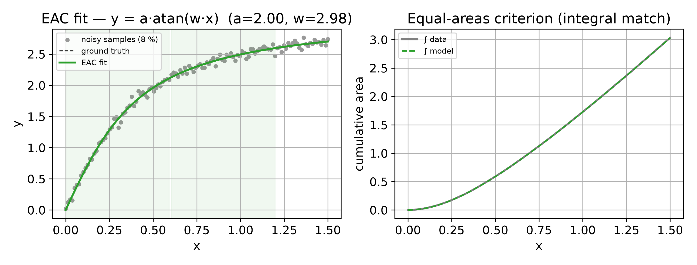

# EAC -- Equal-Areas Criterion

> Numeric batch method, successor to the symbolic DSBE. Source:
> [`image/fit.py`](https://github.com/ringavirda/science-nonline/blob/main/packages/dtfit/src/dtfit/image/fit.py),
> [`image/bases.py`](https://github.com/ringavirda/science-nonline/blob/main/packages/dtfit/src/dtfit/image/bases.py).
> Invoke via `fit_eac(x, y, expr, var, ...)`, `fit(model, data, basis="block",
> order=n_windows)`, or `NonlineRegressor(..., method="eac")`.

EAC is [`fit`](Methods-Image) in the **block** basis: the basis is the set of
indicator functions of `n_windows` equal windows in the normalized variable
`u`, so the image `S` is the vector of window sums -- the areas -- and the
Gram `G` is diagonal, each entry the sum of the sample weights in its window.
The model is projected on the same grid and matched window sum for window
sum. EAC is the numeric successor of the symbolic DSBE, and its block image
is the basis of the streaming [EACFilter](Methods-Equal-Areas-Filter).

## Mathematical grounding

For a model $f(x;\theta)$ with $m$ unknown parameters, the block image splits
the domain into $M \ge m$ equal windows $W_1,\dots,W_M$ and requires the
model's window sum to equal the data's on each:

$$
S_{f,i}(\theta) \;=\; \sum_{k \in W_i} w_k\, f(x_k;\theta)
\qquad = \qquad
S_i \;=\; \sum_{k \in W_i} w_k\, y_k,
\qquad i = 1,\dots,M .
$$

That is $M$ equations in $m$ unknowns -- residuals

$$
r_i(\theta) \;=\; S_i - S_{f,i}(\theta) .
$$

**Connection to the differential spectrum.** The area of a signal over
$[0,H]$ is the integral of its inverse transform,

$$
\int_{0}^{H} x(t)\,dt
   = \sum_{k} X(k)\!\int_0^H\!\Big(\tfrac{t}{H}\Big)^{k}\!dt
   = H\sum_{k} \frac{X(k)}{k+1},
$$

so an area is a **moment of the differential spectrum**. Matching areas over
$M$ shifted windows is matching $M$ independent integral functionals of the
spectrum -- a weak-form (Galerkin, piecewise-constant test function)
identification. Two analytic functions sharing $m$ such independent moments
agree where the model has $m$ degrees of freedom, so the parameters are
recovered.

**Why it is robust.** A window sum averages zero-mean observation noise
toward zero as the window widens: $\sum_{k \in W_i} w_k \varepsilon_k$ grows
slower than the window's own signal content. The data enter EAC only through
these window sums, never through a derivative or a high-order polynomial fit
-- so EAC degrades gracefully as noise rises. The worked example below
recovers a transcendental curve from a visibly noisy cloud by matching window
sums alone.

## Windows

`n_windows` defaults to **four per parameter** (`4 * n_params`); an explicit
value must still leave at least as many windows as parameters, since
[`fit`](Methods-Image) raises when the image has fewer coefficients than the
model has parameters. The windows are equal in the normalized variable `u`
and half-open: a sample exactly on a window's upper edge belongs to the
**next** window; a sample at the domain's end belongs to the last window.
Measured on the model catalog, this recovers parameter RMSE 1.02 to 1.06
times NLLS at four windows per parameter.

`fit_eac` recovers a sharp sigmoid step with its windows spread evenly across
`x` (dotted edges): the block preset uses four uniform windows per parameter,
and the estimate comes from the projection on those windows, not from where
the curve bends.

## Algorithm

1. **Parse** the model; collect the $m$ free parameters $\theta$.
2. **Image** the data in the block basis at `n_windows` (default $4m$):
   $S_i = \sum_{k \in W_i} w_k y_k$, and $G$ diagonal with $G_{ii} =
   \sum_{k \in W_i} w_k$.
3. **Project** the model and its analytic sensitivities
   $\partial f/\partial\theta_j$ onto the same grid:
   $S_{f,i}(\theta) = \sum_{k \in W_i} w_k f(x_k;\theta)$, and likewise for
   the Jacobian columns.
4. **Whiten** by the diagonal Gram: $r(\theta) = L^{-1}\big(S -
   S_f(\theta)\big)$ with $G = LL^\top$ -- for the diagonal block Gram this
   is dividing each window residual by the square root of its weight sum.
5. **Solve**: Levenberg-Marquardt when unbounded, trust-region when `bounds`
   is given, followed by a differential-evolution stage only when every
   bound is finite and the local solve fails, returns a non-finite cost, or
   explains less than half the weighted total sum of squares.
6. **Return** the fitted $\theta$ and, when the degrees of freedom allow, a
   parameter covariance from the SVD of the whitened Jacobian.

## Relation to classical (Western) methods

The Pukhov differential-transformation lineage is largely absent from the Western
literature, but EAC has exact, well-known counterparts there -- naming them makes
the method legible to a signal-processing or system-identification audience and
explains *why* the defaults are what they are.

- **Galerkin weighted residuals (Haar test functions).** Requiring the window-
  sum residual to vanish on each window is exactly a **Galerkin / method-of-
  weighted-residuals** identification with **piecewise-constant (Haar /
  indicator) test functions** $\phi_i$: $\sum_k \phi_i(x_k)\, w_k\,
  [y_k - f(x_k;\theta)] = 0$. The exactly-determined case ($M = m$) is the
  classical square Galerkin system.
- **Over-identified method of moments (GMM).** `fit_eac`'s default of $M =
  4m$ windows is an **over-identified moment system** -- more moment
  conditions than unknowns, solved by least squares. This is the lens that
  justifies windows beyond the parameter count: Hansen's GMM theory says
  extra moment conditions reduce estimator variance and supply the residual
  covariance an exactly-determined system cannot. The robust image is then
  a **robust GMM / M-estimator** on those moment conditions.
- **Alternative routes to the same parameters.** For the special case of sums of
  exponentials / sinusoids, the classical *algebraic* route is **Prony's method**
  and its SVD-robust successors **Matrix Pencil / ESPRIT** (recover the modes as
  roots / subspace eigenvalues rather than by area matching); the *separable*
  route is **variable projection** (Golub-Pereyra). dtfit's experimental suite runs
  these head-to-head as baselines -- see [the baselines page](Experimental-Baselines).

In one line: **EAC is the $h$-version (local Haar) Galerkin / GMM** counterpart of
[LSI](Methods-LSI)'s $p$-version (global spectral) projection -- two faces of the
same weighted-residual identification.

## Robustness to outliers -- the robust image

EAC's outlier defense is the **robust image**: `robust=True`, or any `loss`
other than `"linear"`, runs Huber IRLS on the block regression `y ~ Phi
beta` -- the window means -- before the model is involved: each sample's
weight is scaled by `min(1, c s / |r_i|)`, `c = 1.345`, `s` the MAD scale of
the regression residual, five passes. Measured with 10 percent outliers at
ten sigma, the robust image gives parameter RMSE 0.34 to 0.38 of plain
NLLS -- the same reduction scipy's `soft_l1` loss gives.

For a record densely contaminated with outliers, reach for
[`ensemble_fit`](Methods-Ensemble) instead: it rejects whole bad windows by a
coordinate-wise median across many overlapping fits, rather than reweighting
individual samples within one image.

## Optimizations and guards

- **Diagonal Gram** -- the block basis's windows never overlap, so `G` is
  diagonal and whitening the residual amounts to a per-window division by
  the square root of its weight sum.
- **Per-sample sensitivity mask** -- a transcendental sensitivity can be
  singular at an isolated sample while its window sum stays finite elsewhere
  (e.g. $\partial_n\, x^{n} = x^{n}\ln x$ is `NaN` at $x=0$, with limit $0$).
  Such a sample is zeroed before the projection so it cannot poison a window
  sum or a Jacobian column.
- **Sample-count guard** -- an image at `n_windows` windows needs at least
  `n_windows + 1` samples; `fit_eac` raises otherwise.
- **Coverage does not apply** -- [`coverage`](Methods-Image) measures
  Legendre truncation error and returns `0.0` for the block basis; `fit`
  never runs the coverage check on an EAC image.

## Worked example

`y = a.arctan(w.x)` (truth `a=2.0, w=3.0`), a transcendental **non-Taylor**
saturation curve, with 8 % noise. **Left:** EAC recovers `a~=2.00, w~=2.99` from the
noisy cloud; the shaded bands are the per-parameter integration windows. **Right:**
the equal-areas criterion -- the cumulative integral of the fitted model (dashed)
tracks the cumulative integral of the data, which is the quantity EAC actually
matches.

## Comparison

**Model data -- `y = a.exp(b.x)`, ground truth a=1.0, b=1.2, 5 % noise, n=80.**
Error is against the *clean* signal.

| method | recovered params | R^2 | RMSE | MAPE % | fit (ms) |
|---|---|---|---|---|---|
| LSI | a=1.000, b=1.203 | 0.9999 | 0.01133 | 0.24 | 15.3 |
| **EAC** | a=1.002, b=1.203 | 0.9999 | 0.01641 | 0.41 | 3.4 |
| SciPy `curve_fit` | a=1.000, b=1.204 | 0.9999 | 0.01305 | 0.25 | 0.1 |
| numpy.polyfit (deg 5) | -- | 0.9997 | 0.02302 | 0.85 | 0.1 |

EAC recovers the parameters essentially as well as LSI and the NLS gold standard
while being the **fastest** of the dtfit methods (~=3 ms here -- roughly 5x LSI),
because it solves a small area-matching system instead of a spectral least-squares
problem. That speed and its derivative-free robustness are why EAC is the basis of
the streaming [EACFilter](Methods-Equal-Areas-Filter).

**Real data -- COVID-19 Ukraine** (28-day take-off, 548->8617 cases),
`y = a.exp(b.t)`:

| method | R^2 | RMSE | MAPE % |
|---|---|---|---|
| LSI | 0.9877 | 275.1 | 13.00 |
| **EAC** | 0.8506 | 960.1 | 9.39 |
| SciPy `curve_fit` | 0.9879 | 273.5 | 13.34 |

## Where it is best applied

**Use EAC for:** noise-robust batch fitting of few-parameter (2-4) transient
and saturating shapes, when speed and a minimal statistic matter -- the block
image is `n_windows` sums -- the batch form of the streaming
[EACFilter](Methods-Equal-Areas-Filter)'s measurement and of the MCU block
images. For peaks and cycles the Legendre preset at
[`order_for`](Methods-Image) is the more statistically efficient image;
`Model.fit` and the `auto` route send peaks to the block basis; that is a
routing choice, not an efficiency claim.
Outlier-prone data reach for the robust image (`robust=True`) or, densely
contaminated, [`ensemble_fit`](Methods-Ensemble); a whole-record EAC fit is
also a fast, stable initializer for a slower method.

**Caveats.** EAC's window sums partly cancel **oscillations** -- for a cycle
use [LSI](Methods-LSI)'s oscillatory recipe or the streaming
[LSIFilter](Methods-Legendre-Filter). Like the other image methods it assumes a
modest dynamic range -- normalize wide domains first. For real-time tracking of
*time-varying* parameters, use the recursive [EACFilter](Methods-Equal-Areas-Filter).
</content>
