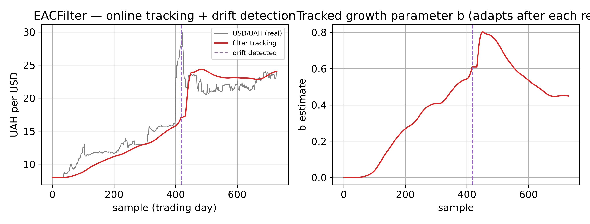

# EACFilter -- the block-basis alias

> Numeric **online** method. Source:
> [`streaming/filter.py`](https://github.com/ringavirda/science-nonline/blob/main/packages/dtfit/src/dtfit/streaming/filter.py).
> Invoke via `EACFilter(expr, var, p0=, window_size=, ...)` then
> `flt.partial_fit(t, y)` per sample; `flt.predict(x)`, `flt.params_`.

`EACFilter` is [`ImageFilter`](Methods-Legendre-Filter) with `basis` fixed
to `"block"` -- the streaming twin of batch [EAC](Methods-EAC). Its window
measurement is the block image: window sums against a diagonal Gram, the
cheapest per-sample statistic of the two bases and the one an embedded
target runs (see [the embedded tool](Domain-Embedded-Control)). Its
sibling [`LSIFilter`](Methods-Legendre-Filter) fixes the Legendre basis
instead, whose spectral measurement resolves an oscillatory plant's
shape and frequency directly.

Everything else -- the whitened window-image measurement, the
information-form update, drift detection through the shared
[`DriftDetector`](API-Streaming#driftdetector), the adaptive window,
robust winsorization, `result()`'s calibrated covariance and coasting --
is `ImageFilter`'s and is described once, on
[its method page](Methods-Legendre-Filter).

## Worked example

USD/UAH official daily rate, NBU, 2014-2015 hryvnia crisis (~=8 -> 24).
**Left:** the filter tracks the depreciation online and flags the
**Feb-2015 free-float** as a structural break (dashed line). **Right:**
the tracked growth parameter `b` -- it climbs with the depreciation,
jumps at the detected break, and re-adapts after the drift reset.

## Where it is best applied

Use `EACFilter` for monotone or saturating plants where the block image's
low per-sample cost matters, or as the streaming path an embedded target
runs. For an oscillatory plant use [`LSIFilter`](Methods-Legendre-Filter).
For an accurate *static* batch fit use [LSI](Methods-LSI) or
[EAC](Methods-EAC).
