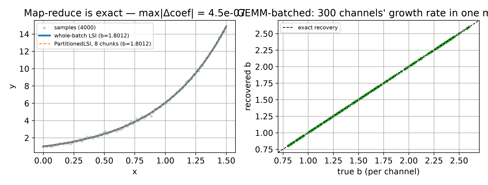

# Streams -- the additive image at scale

> Source: [`image/stream.py`](https://github.com/ringavirda/science-nonline/blob/main/packages/dtfit/src/dtfit/image/stream.py),
> [`image/transfer.py`](https://github.com/ringavirda/science-nonline/blob/main/packages/dtfit/src/dtfit/image/transfer.py),
> [`image/parallel.py`](https://github.com/ringavirda/science-nonline/blob/main/packages/dtfit/src/dtfit/image/parallel.py).
> API: [../api/scaling.md](API-Scaling).

[The image](Methods-Image) runs at scale because of two structural properties,
both exact: it is **additive over sample sets** -- a sum over samples, no
boundary carry -- and **linear across channels**. `ImageStream` is the one
class that exploits both.

## Additive over sample sets -> streaming and map-reduce

The projections `S = Phi^T (w y)` and the Gram `G = Phi^T diag(w) Phi` are
each a sum over samples, so a sum over a partition of the samples is the
whole-domain sum:

$$
S = \sum_p \Phi_p^\top (w_p \, y_p), \qquad
G = \sum_p \Phi_p^\top \mathrm{diag}(w_p) \, \Phi_p .
$$

`ImageStream`'s accumulator (`block=None`) folds this sum chunk by chunk in
memory fixed by the order, not the sample count -- the `(K+1) x (K+1)` Gram
and the `K+1` projections, `O(order^2)`: `update(x, y, w=None)` adds one
chunk, `image()` reads the running `S`, `G`, `n`, `sumsq` off as an `Image`.
No interval connects two chunks, so there is nothing to carry across a chunk
boundary -- the sum is exact term by term. This is fixed size only on a
uniform grid; with `grid="explicit"` the stream also keeps every position
and weight, so memory grows with the sample count. `merge(other)` adds two streams' sums (both
need the same configuration; uniform streams must be contiguous), the
distributed step: each worker accumulates its own shard, and `merge` folds
the partials into one. `checkpoint()` serializes the running sums,
`resume(state)` continues from them exactly, so a stream survives a process
restart or crosses a process boundary.

```python
acc = ImageStream("legendre", 6, domain=(0, 4))
for x_chunk, y_chunk in stream:
    acc.update(x_chunk, y_chunk)
res = fit("a0 + a1*exp(a2*x)", acc.image(), "x")
```

## Blocks and transfer

`block` a sample count or a domain length puts the stream in block mode: each
finished block is imaged over its own local domain rather than accumulated
into one running sum. Block membership is half-open on the right,
`[x0, x1)` -- a sample landing exactly on a block's upper edge belongs to the
next block, except at the domain's own end, which belongs to the last block.

Block images at different local domains and orders are combined by
**transfer**, not by naive addition: `legendre_transfer(local_domain,
coarse_domain, local_order, coarse_order)` finds the change-of-basis matrix
`A` with `Phi_coarse = Phi_local @ A`, exact to rounding whenever
`coarse_order <= local_order`, because a coarse Legendre polynomial
restricted to a sub-domain is a polynomial of the same degree in the local
variable. `block_transfer` does the same for
the block basis with a 0/1 aggregation matrix: a coarse window must be a
union of fine blocks, or the call raises -- the union rule. `assemble`
transfers every given image onto one coarse domain and merges the results;
`ImageStream.assemble(t0, t1, order=None)` calls it on the stored blocks
inside `[t0, t1]`, and `blocks(t0, t1)` lists them without merging.

Retention bounds how many block images the stream keeps: once there are more
than `keep_fine` fine blocks, the oldest `fold` are folded into one coarse
block at the stream's order (`keep_fine`, `fold`, both at least 1; the peak
retained count is `max(keep_fine, fold)` when `fold > keep_fine`). Folding
bounds the block *count*, not the grid: with `grid="explicit"` the coarse
block's grid is the union of its fine blocks' positions, so an irregular
sample set is not compacted.

```python
blk = ImageStream("legendre", 3, domain=(0, 4), block=1.0)
for x_chunk, y_chunk in stream:
    blk.update(x_chunk, y_chunk)
blk.close()
whole = blk.assemble(0, 4)
```

## Linear across channels -> one GEMM

`channels=B` shares one Gram across `B` signals sampled at the same
positions: `update(x, Y)` takes `Y` of shape `(n, B)` and folds all `B`
projections `(B, K+1)` in a single matrix product per chunk, dispatched to
the `numpy`, `cupy` or `torch` backend named by `backend=`. The Gram update
itself stays host numpy regardless of backend, since it does not touch `Y`.
`image(channel)` reads one channel's running image, `images()` all of them.

## Drift on block streams

`detect="previous"` or `detect=(model, params[, var])` runs a
`DriftDetector` on the whitened residual between each finished block's
coefficients and either the previous block or that model's image on the
same domain, and records a flagged boundary as `(block_index, domain)` in
`flags_`. The per-sample equivalent -- drift on an innovation stream rather
than block boundaries -- is the filters' own detector; see
[the LSI filter](Methods-Legendre-Filter).

## `fit_many`

Orthogonal to the image: for **many independent problems** (different series
and/or models), `fit_many(problems, n_jobs=...)` fans the fits across a
`joblib` pool (`"loky"` processes, `"threading"`, or `"multiprocessing"`).
Each `FittingProblem` is picklable and a failed fit is captured per-problem
(its `error` set) rather than aborting the batch; results come back in input
order as ordinary picklable `FittingResult`s, each carrying the problem's
`.label` -- batch and single fits return the same type.

## Optimizations and guards

- **Float64 accumulation** -- `S` and `G` accumulate in float64 regardless of
  the channel backend; a producer that must emit float32 (an MCU) should keep
  chunks to at most 10,000 samples: measured float32 error is 2.4e-3
  sequential over 1e6 samples but only 1.8e-5 per 1e4-sample chunk.
- **Throughput** -- measured 37 million samples/s at order 12 with the Gram
  update, on one core.
- **The Legendre transfer's order guard** -- `legendre_transfer` raises unless
  `coarse_order <= local_order`, so a stream cannot silently assemble onto an
  order finer than a block actually carries.
- **The union rule** -- `block_transfer` raises if a coarse window is not a
  union of fine blocks, rather than aggregating a fine window into two
  coarse ones.
- **`close()` for a partial block** -- finishes the block currently being
  filled if it holds at least `order + 2` samples, else leaves it untouched;
  needed to read out a stream's last, still-open block.

## Worked example

**Left:** an image accumulated over 8 chunks equals a single whole-domain
pass. **Right:** 300 channels' growth rate recovered in one GEMM, each
landing on the truth diagonal.



## Where it is best applied

| situation | tool |
|---|---|
| accumulate a stream in fixed memory | `ImageStream` accumulator |
| distributed workers, then combine | `ImageStream.merge` |
| block streams with retention, assembly and drift flags | `ImageStream` block mode |
| many channels on a shared grid | `ImageStream` channels |
| many independent series/models | `fit_many` |

**Trade-off.** The accumulator and block modes trade peak throughput for
**bounded memory**; the channel batch trades memory (`Y` resident) for
**maximal throughput** in one GEMM. Both are exact relative to a single
whole-domain image. For real-time *online* tracking (as opposed to batch
at scale) use the
[streaming filters](Methods-Legendre-Filter).
